2022-11-15

**更新了针对最新的yolov5代码的ji_new.py**

2022-11-16

**更新了用于测试多边形的ji_polygon.py 感谢qian0733提供的代码**

2022-12-02

**增加了run.sh 删除 trainval 防止出现使用编码环境里面数据进行训练**

**修改yaml文件name改成names,使用高版本yolov5训练问题**

**增加yolov6数据处理代码 split_v6.py**

## 1.报名打榜

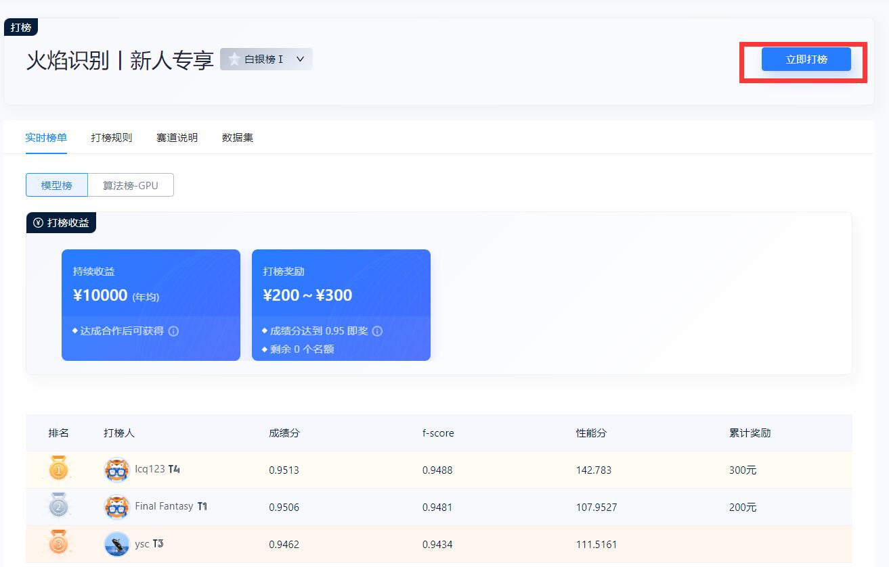

## 2.创建镜像

**2.1 创建镜像**

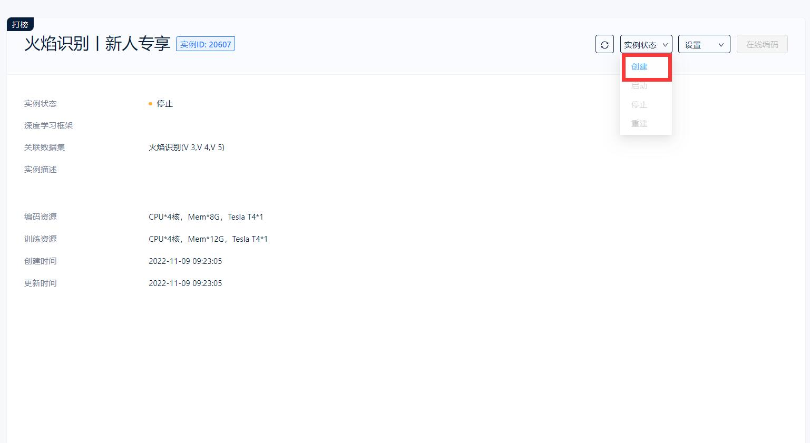

**2.2 选择torch编码环境**

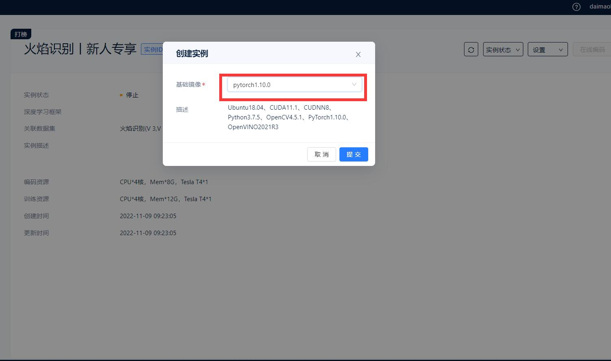

**进入编码环境**

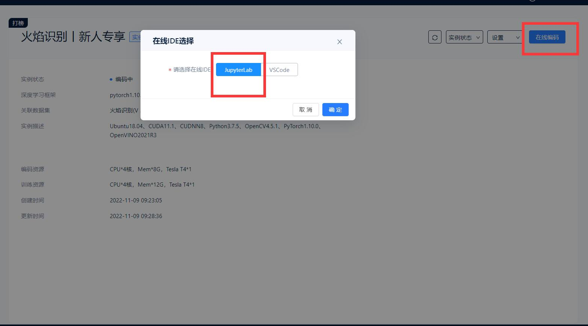

## 3.编码环境

**新建Terminal**

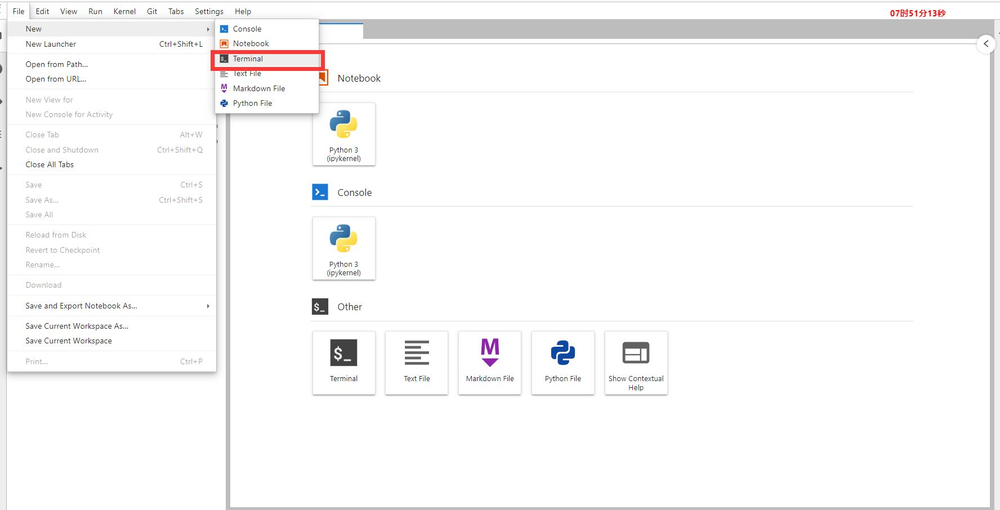

### 3.1 数据介绍

```shell
#新建Terminal
cd /home/data
ls
```

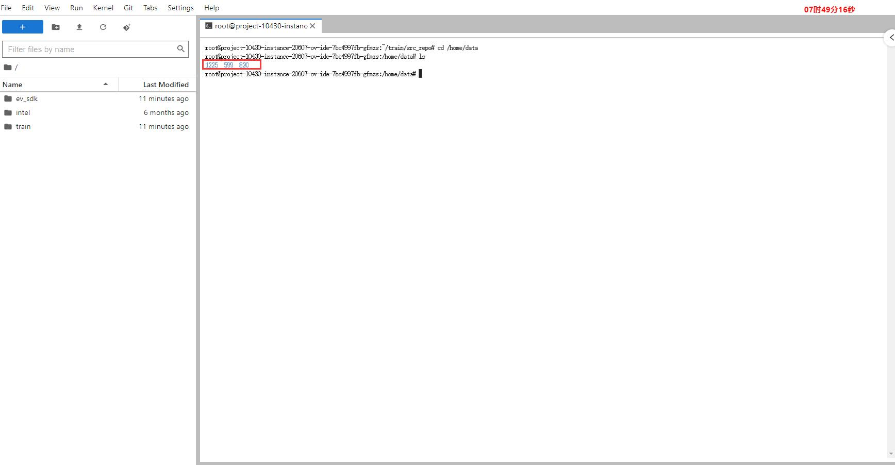

**将数据拷贝到/project/train/src_repo**

```
cp -r /home/data/1225 /project/train/src_repo/trainval
cp -r /home/data/599 /project/train/src_repo/trainval
cp -r /home/data/820 /project/train/src_repo/trainval
```

### 3.2 数据处理

**将代码中的split.py 直接拷贝，修改路径**，**主要修改下面两张图的部分**

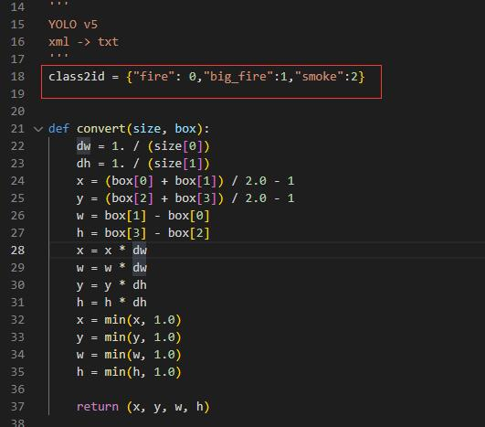

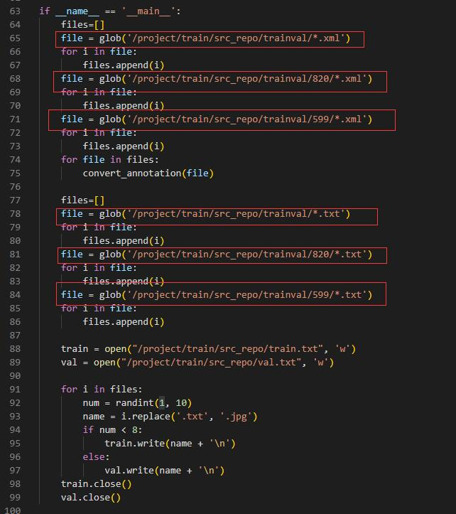

**运行split.py**

```
python split.py
```

### 3.3 yolov5代码

```shell
#下载yolov5代码
wget https://extremevision-js-userfile.oss-cn-hangzhou.aliyuncs.com/user-14177-files/6c888875-7de7-4f60-ba15-88de0304fe70/yolov5.zip
#解压
unzip yolov5.zip
cd yolov5
#安装python库
pip install -r requirements.txt 
#下载yolov5s模型
wget https://extremevision-js-userfile.oss-cn-hangzhou.aliyuncs.com/user-14177-files/d8ee0651-9d48-4480-a161-d22750ba7eba/yolov5s.pt
wget https://extremevision-js-userfile.oss-cn-hangzhou.aliyuncs.com/user-14177-files/d97a419e-2bb4-4822-b398-b37244473a5f/Arial.ttf
```

**在yolov5/data/目录下新建fire.yaml文件**

```yaml
#数据路径，不用更改
train: ../train.txt
val: ../val.txt

#类别数量，根据题目设定
nc: 3

#类别名称，根据题目设定
name: ['fire','big_fire','smoke']
```

```
python train.py --batch-size 32 --epochs 3 --data ./data/fire.yaml --hyp ./data/hyps/hyp.scratch-low.yaml --weight ./yolov5s.pt --img 640 --project /project/train/models/ --cfg ./models/yolov5s.yaml
```


## 4.训练

 **就是在编码做了哪些事情，在训练环境环境也需要去做**

**新建 run.sh 脚本**

```shell
cp -r /home/data/1225 /project/train/src_repo/trainval
cp -r /home/data/599 /project/train/src_repo/trainval
cp -r /home/data/820 /project/train/src_repo/trainval
python /project/train/src_repo/split.py
cd /project/train/src_repo/yolov5
python train.py --batch-size 64 --epochs 100 --data ./data/fire.yaml --hyp ./data/hyps/hyp.scratch-low.yaml --weight ./yolov5s.pt --img 640 --project /project/train/models/ --cfg ./models/yolov5s.yaml
```

**发起训练之前将编码环境里面生成的数据清理一下**

**删除 trainval 文件夹**

**删除 val.txt ,train.txt val.cache train.cache**

**删除 /project/train/models/ 文件夹下面的所有文件**


**发起训练**

在执行命令里面输入

```
bash /project/train/src_repo/run.sh
```


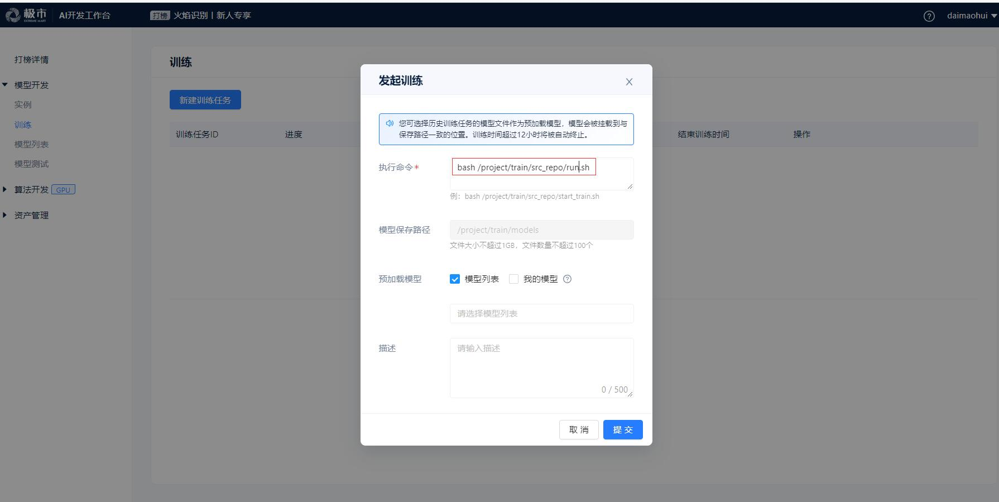


## 5.测试

**在 ev_sdk/src/ 目录下新建ji.py** 

**只需要更改这里的参数**

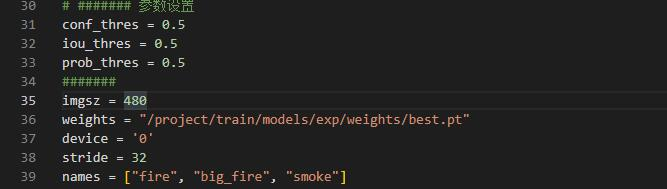

## 6 问题

    1.编码环境无法访问github.com
    
    		需要将文件下载到本地，然后通过我的文件上传，之后通过wget进行下载
    
    2.运行yolov5代码的时候，会遇到下载Arial.ttf失败的问题
    
    		使用wget https://extremevision-js-userfile.oss-cn-hangzhou.aliyuncs.com/user-14177-files/d97a419e-2bb4-4822-b398-b37244473a5f/Arial.ttf
    
    3.跟着平台的新手教程，测试过程报错
    
    	因为平台前不久升级配套问题，使用新手教程的同学们，如果下载的是yolov5最新的代码，那么新手教程里面ji.py 文件运行起来会报错，可以使用https://github.com/daimaohui/cvmart_yolov5/tree/main/code/ji_new.py
    
    4.为什么训练完成之后，在编码环境里面找不到训练的模型
    
    	训练环境与编码环境是隔离的，只能查模型列表里面查看训练产生的模型
    
    5.保存模型大小最大不能超过1G
    
    		建议在发起训练的时候，最好将/project/train/models 文件夹下面所有的文件清空
    
    6.查看tensorboard


​    

utils/logger/__init__.py  `/project/train/tensorboard`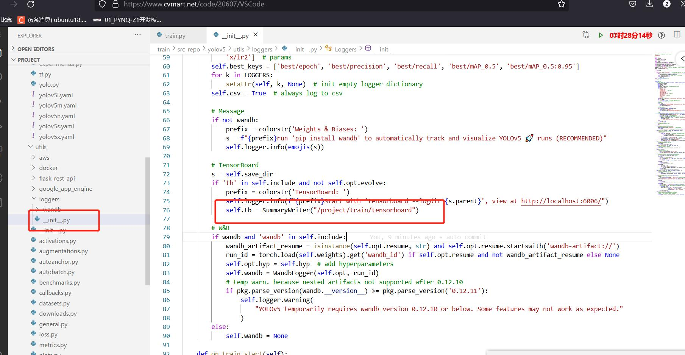
